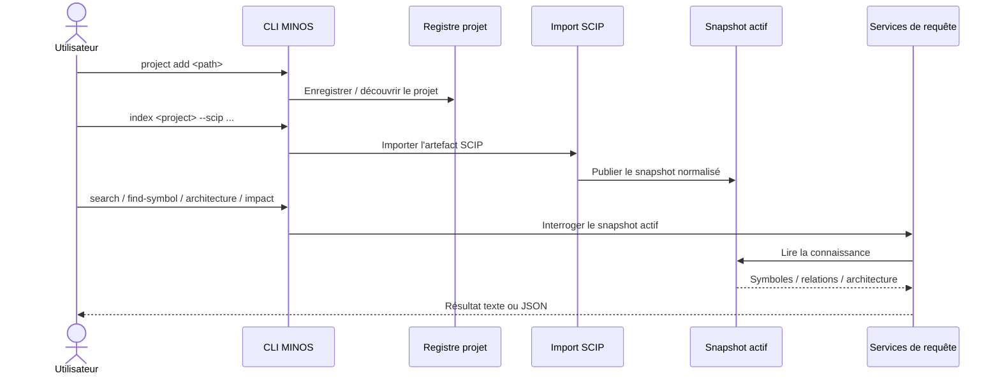

# Guide utilisateur MINOS

Ce guide s’adresse à une personne qui veut **installer, alimenter et interroger MINOS** sans modifier son code source.

## Ce que fait MINOS

MINOS maintient une connaissance structurée d’un projet logiciel à partir d’artefacts d’indexation structurés, notamment SCIP. Cette connaissance comprend les symboles, usages, relations, tests liés, architecture, dépendances et impacts potentiels.

MINOS est local-first : la CLI, l’API Java et le serveur MCP fonctionnent sans serveur HTTP obligatoire.

## Parcours recommandé



## Démarrage rapide

Prérequis : **JDK 24**. Le build Maven exige Java `[24,25)` et Maven 3.9.x.

Sous Windows PowerShell :

```powershell
cd N:\workspace-dev\minos-code-intelligence
.\mvnw.cmd clean verify
```

Le build produit notamment :

```text
target/minos-code-intelligence-0.1.0-SNAPSHOT-all.jar
```

Afficher l’aide :

```powershell
java -jar .\target\minos-code-intelligence-0.1.0-SNAPSHOT-all.jar --help
```

Enregistrer un projet :

```powershell
java -jar .\target\minos-code-intelligence-0.1.0-SNAPSHOT-all.jar `
  project add N:\workspace-dev\my-project --name my-project
```

Importer un index SCIP déjà produit :

```powershell
java -jar .\target\minos-code-intelligence-0.1.0-SNAPSHOT-all.jar `
  index my-project `
  --scip N:\workspace-dev\my-project\index.scip `
  --provider scip-typescript `
  --provider-version 0.4.0
```

Rechercher du code :

```powershell
java -jar .\target\minos-code-intelligence-0.1.0-SNAPSHOT-all.jar `
  search my-project GreetingPort --format json
```

## Important : MINOS n’exécute pas automatiquement les indexeurs SCIP

La commande `index` importe un **artefact SCIP existant**. Elle ne prétend pas lancer automatiquement `scip-java`, `scip-typescript` ou un autre indexeur externe.

Cette frontière est intentionnelle : MINOS sépare la production de l’artefact fournisseur de sa normalisation et de sa publication dans le moteur de connaissance.

## Comment identifier un projet

Les commandes acceptent un identifiant projet. Dans les usages habituels, utiliser le nom enregistré avec `project add --name` ou l’UUID renvoyé par MINOS.

Lister les projets :

```powershell
java -jar .\target\minos-code-intelligence-0.1.0-SNAPSHOT-all.jar project list
```

Inspecter un projet :

```powershell
java -jar .\target\minos-code-intelligence-0.1.0-SNAPSHOT-all.jar inspect my-project
```

## Formats de sortie

Les commandes stables proposent généralement :

```text
--format text
--format json
```

Utiliser `text` pour une lecture humaine et `json` pour l’automatisation, MCP, scripts ou autres intégrations.

## Codes de sortie CLI

```text
0  succès
1  erreur d’exécution
2  erreur d’usage / arguments invalides
```

## Fonctionnalités principales

| Besoin | Commande / surface |
|---|---|
| Enregistrer un projet | `project add` |
| Voir les projets | `project list` |
| Inspecter l’état | `inspect`, `index-status` |
| Importer un SCIP | `index` |
| Rechercher du contexte | `search` |
| Trouver un symbole | `find-symbol` |
| Lire un fichier source | `get-source` |
| Trouver les usages | `find-usages` |
| Trouver implémentations/appels/dépendances | commandes relationnelles |
| Trouver les tests liés | `related-tests` |
| Lire l’architecture | `architecture` |
| Estimer un impact | `impact` |
| Consommer depuis Java | `MinosApi`, `MinosMultiRepositoryApi` |
| Exposer MINOS à un agent | serveur MCP |
| Exporter vers NEXUS | `nexus-export` |

## Suite

- [Installation et configuration](installation.md)
- [Référence complète de la CLI](cli.md)
- [API Java locale](java-api.md)
- [Serveur MCP](mcp.md)
- [Intégration NEXUS](nexus.md)
- [Dépannage](troubleshooting.md)
