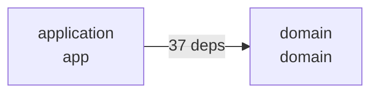

# Visualiser le graphe d'architecture MINOS

Cette page répond à une question unique : **comment voir concrètement le graphe produit par MINOS ?**

> À retenir : MINOS calcule et exporte le graphe, mais **n'ouvre pas aujourd'hui une fenêtre graphique intégrée**. Pour une visualisation graphique, MINOS produit du **Mermaid** ou du **Graphviz DOT**, puis un renderer compatible affiche le résultat.

## Parcours en 30 secondes

Prérequis : le projet doit être enregistré et avoir un snapshot actif.

```powershell
minos.cmd project list
minos.cmd index-status my-project
```

Si le projet n'est pas encore indexé :

```powershell
minos.cmd project add N:\workspace-dev\my-project --name my-project
minos.cmd index my-project
```

### Option A — voir les données du graphe immédiatement

```powershell
minos.cmd architecture my-project --format json
```

La liste des arêtes inter-modules est dans :

```text
moduleDependencies
```

Pour n'afficher que ces arêtes dans PowerShell :

```powershell
minos.cmd architecture my-project --format json |
  ConvertFrom-Json |
  Select-Object -ExpandProperty moduleDependencies
```

### Option B — produire un diagramme Mermaid

```powershell
minos.cmd architecture my-project --format mermaid |
  Set-Content .\architecture.mmd -Encoding utf8
```

Le fichier `architecture.mmd` contient un `flowchart` Mermaid, par exemple :



Ouvrir ensuite `architecture.mmd` dans un renderer compatible Mermaid, ou copier son contenu dans un bloc Mermaid Markdown.

### Option C — produire un SVG ou PNG avec Graphviz

MINOS produit d'abord le fichier DOT :

```powershell
minos.cmd architecture my-project --format dot |
  Set-Content .\architecture.dot -Encoding utf8
```

Si la commande Graphviz `dot` est installée :

```powershell
dot -Tsvg .\architecture.dot -o .\architecture.svg
Start-Process .\architecture.svg
```

Pour un PNG :

```powershell
dot -Tpng .\architecture.dot -o .\architecture.png
Start-Process .\architecture.png
```

Graphviz est **optionnel** : MINOS n'en a pas besoin pour calculer le graphe. Il ne sert qu'à transformer le DOT en fichier graphique.

## Que représente exactement le graphe ?

MINOS construit un **graphe orienté de dépendances entre modules** à partir du snapshot actif.

```text
module A ──37 dépendances──> module B
```

signifie que MINOS a agrégé 37 dépendances observées depuis des symboles du module A vers des symboles du module B.

Le rendu Mermaid/DOT utilise directement les arêtes de `ArchitectureDependencyGraph.dependencies()` ; il n'invente pas de liens supplémentaires pour rendre le diagramme plus joli.

## JSON : lire précisément les nœuds et les arêtes

Commande :

```powershell
$architecture = minos.cmd architecture my-project --format json | ConvertFrom-Json
```

Informations utiles :

```powershell
# Nombre de modules
$architecture.moduleCount

# Nombre d'arêtes inter-modules agrégées
$architecture.dependencies.moduleEdges

# Modules
$architecture.modules

# Arêtes
$architecture.moduleDependencies
```

Une arête contient notamment :

```json
{
  "sourceModuleId": "<source-module-id>",
  "sourceModuleName": "application",
  "targetModuleId": "<target-module-id>",
  "targetModuleName": "domain",
  "dependencyCount": 37,
  "sourceSymbolCount": 12,
  "targetSymbolCount": 9,
  "nature": "DERIVED",
  "confidence": 1.0
}
```

Les valeurs ci-dessus sont illustratives ; les champs correspondent à la sortie actuelle de `architecture --format json`.

## Gros projet : limiter le graphe à un module et ses voisins

Pour Mermaid ou DOT, `--module` conserve :

- le module demandé ;
- ses voisins directs entrants ;
- ses voisins directs sortants ;
- les arêtes qui relient ce voisinage au module demandé.

Exemple :

```powershell
minos.cmd architecture my-project `
  --module packages/api `
  --format mermaid |
  Set-Content .\architecture-api.mmd -Encoding utf8
```

Le paramètre `--module` accepte :

1. l'identifiant technique du module ;
2. son chemin relatif, par exemple `packages/api` ;
3. son nom, uniquement s'il est unique.

Si plusieurs modules portent le même nom, utiliser l'identifiant ou le chemin relatif.

Pour obtenir le contexte compact d'un seul module en JSON :

```powershell
minos.cmd architecture my-project --module packages/api --format json
```

Attention : `--module ... --format json` renvoie le **contexte compact du module**. Pour récupérer la liste complète `moduleDependencies`, utiliser `architecture my-project --format json` sans `--module`.

## Avec Copilot, Claude ou Codex via MCP

Le serveur MCP MINOS expose :

```text
minos_architecture_graph
```

Arguments :

```text
project  obligatoire
module   optionnel
format   json | mermaid | dot
```

Exemples de demandes à un agent :

```text
Utilise minos_architecture_graph sur le projet my-project au format json et explique les dépendances entre modules.
```

```text
Utilise minos_architecture_graph sur le projet my-project au format mermaid et renvoie le diagramme.
```

```text
Utilise minos_architecture_graph sur le projet my-project, module packages/api, au format mermaid.
```

Le tool MCP renvoie la représentation demandée. L'affichage graphique automatique du Mermaid/DOT dépend ensuite des capacités du client MCP utilisé ; la source du graphe reste toujours disponible.

## Le graphe est vide : diagnostic rapide

### 1. Vérifier que le projet existe

```powershell
minos.cmd project list --format json
```

### 2. Vérifier qu'un snapshot actif existe

```powershell
minos.cmd index-status my-project --format json
```

La commande `architecture` nécessite un snapshot actif. Si le projet n'en possède pas encore :

```powershell
minos.cmd index my-project
```

### 3. Vérifier le nombre d'arêtes

```powershell
$architecture = minos.cmd architecture my-project --format json | ConvertFrom-Json
$architecture.moduleCount
$architecture.dependencies.moduleEdges
$architecture.moduleDependencies.Count
```

Si `moduleEdges` vaut `0`, MINOS n'a aucune arête **inter-module** à dessiner dans le snapshot actif. Ce n'est pas une erreur du renderer Mermaid/DOT.

Un projet mono-module peut donc produire un diagramme avec un nœud mais aucune flèche.

### 4. Vérifier les modules découverts

```powershell
$architecture.modules |
  Select-Object id, name, relativePath, symbolCount
```

Cela permet aussi de récupérer la valeur exacte à fournir à `--module`.

## Résumé des formats

| Besoin | Commande |
|---|---|
| Lire l'architecture dans le terminal | `minos.cmd architecture my-project --format text` |
| Exploiter nœuds/arêtes par script | `minos.cmd architecture my-project --format json` |
| Produire un diagramme Mermaid | `minos.cmd architecture my-project --format mermaid` |
| Produire un fichier Graphviz | `minos.cmd architecture my-project --format dot` |
| Limiter Mermaid/DOT à un voisinage | `--module <id|chemin|nom-unique>` |
| Interroger depuis un agent MCP | `minos_architecture_graph` |

## Références liées

- [Guide utilisateur](README.md)
- [Référence CLI](cli.md)
- [Installation PROD Windows](production-installation.md)
- [MCP natif](mcp.md)
- [API Java locale](java-api.md)
