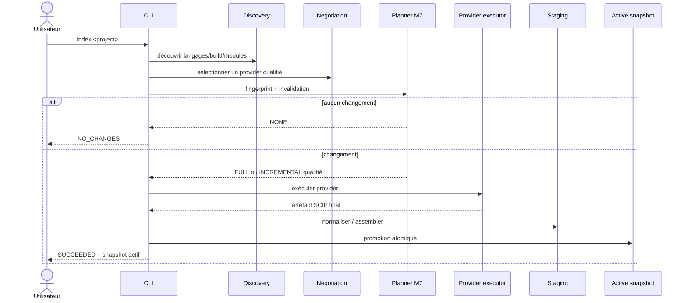

# Indexation autonome

M14 fait de `minos index <project>` le parcours normal d'alimentation de MINOS.

## Flux



## Diagnostic avant exécution

```powershell
minos index my-project --dry-run --format json
```

Le dry-run ne lance aucun provider. Il calcule néanmoins la découverte, la négociation, l'état runtime et la portée d'indexation.

## Choix du provider

MINOS utilise le `IndexerRegistry` existant :

- langage détecté ;
- build system compatible ;
- capacités déclarées ;
- niveau de qualification ;
- priorité déterministe.

Override explicite :

```powershell
minos index my-project --provider scip-java
```

Un override incompatible avec le projet est rejeté ; il ne force pas MINOS à inventer une capacité.

## Portée NONE/FULL/INCREMENTAL

Le planner M7 reste source de vérité.

Pour les providers actuellement gérés par M14 :

- `scip-java` : `INCREMENTAL_INDEXING` non qualifié ;
- `scip-typescript` : `INCREMENTAL_INDEXING` non qualifié.

Donc le comportement conservateur initial est :

```text
projet inchangé                         -> NONE
source/test modifié                     -> FULL
build/ignore/fichier non qualifié changé -> FULL
```

`--force-full` impose un run FULL même si le fingerprint est inchangé :

```powershell
minos index my-project --force-full
```

## Provider Java

Le runtime géré utilise une version verrouillée de `scip-java` et Coursier.

Préconditions du projet :

```text
pom.xml
JAVA_HOME -> JDK avec javac
build Maven exploitable
```

L'indexeur est lancé depuis la racine du projet. Le `index.scip` éventuellement déjà présent est préservé et restauré après le run ; MINOS travaille sur une copie conservée dans son répertoire de run.

## Provider TypeScript

Le runtime géré installe `scip-typescript` localement dans `MINOS_HOME/tools`.

Préconditions :

```text
node
npm
tsconfig.json ou package.json compatible
dépendances du projet déjà installées
```

MINOS ne prépare jamais silencieusement `node_modules`.

## Répertoires de run

Chaque provider exécuté produit des diagnostics sous :

```text
<MINOS_HOME>/runs/<runId>/<provider>/
├── provider.stdout.log
├── provider.stderr.log
├── process.txt
├── index.scip
└── failed-index.scip       # uniquement lorsqu'un artefact partiel existe
```

`process.txt` conserve la commande effective, le working directory, le timeout et les dates. Les arguments manifestement sensibles (`token`, `password`, `secret`) sont masqués dans le rendu de commande.

## Staging et promotion

Un artefact provider ne devient jamais directement le snapshot actif.

```text
provider artifact
   ↓
temporary provider normalization
   ↓
provider facts
   ↓
project assembly
   ↓
staged project snapshot
   ↓
atomic promotion
   ↓
active snapshot
```

Si plusieurs providers sont sélectionnés, les collisions d'identifiants sont rejetées plutôt que fusionnées silencieusement.

## Échec de refresh

Le lifecycle historique reste appliqué :

```text
READY -> REFRESHING -> READY    succès
READY -> REFRESHING -> STALE    échec
```

En `STALE`, l'ancien snapshot actif reste lisible.

## Workspace modifié pendant le run

MINOS capture un fingerprint avant et après l'exécution.

Si le projet a changé pendant l'indexation :

- le snapshot produit peut avoir été promu par le lifecycle ;
- le fingerprint baseline n'est **pas** promu ;
- le run signale explicitement le diagnostic ;
- le prochain `index` retombera conservativement sur une nouvelle indexation.

## Import manuel

L'import d'un artefact externe reste disponible :

```powershell
minos import-scip my-project --file .\index.scip --provider custom
```

Ce chemin est destiné aux diagnostics, fixtures et providers qui ne disposent pas encore d'un executor MINOS.
