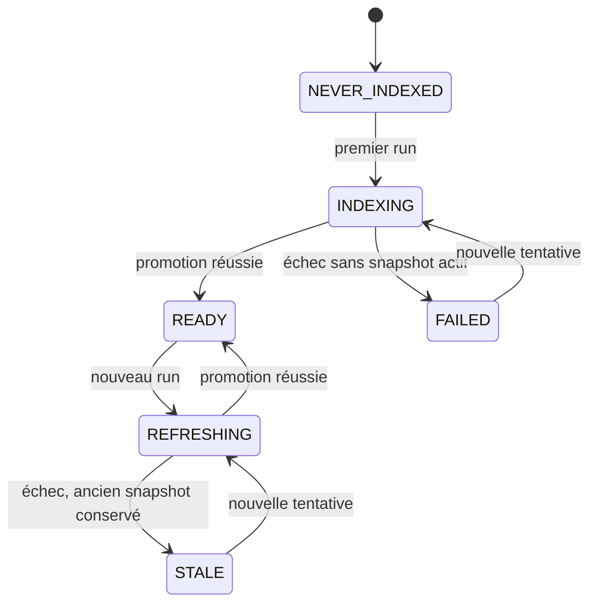

# Référence CLI

La CLI stable est exposée par `com.minos.cli.MinosLauncher`.

```powershell
java -jar .\target\minos-code-intelligence-0.1.0-SNAPSHOT-all.jar <commande>
```

Pour toute commande, `--help` reste la source de vérité exécutable.

## Vue d’ensemble

```text
Project and index
  project add
  project list
  project inspect
  inspect
  index
  index-status

Code intelligence
  search
  find-symbol
  get-source
  find-usages
  find-implementations
  find-callers
  find-callees
  dependencies
  dependents
  related-tests
  architecture
  impact

Integration
  nexus-export
```

## Administration des projets

### `project add`

```text
minos project add <path> [--name <name>] [--format <text|json>]
```

Exemple :

```powershell
java -jar $minos project add N:\workspace-dev\app --name app --format json
```

Sans `--name`, MINOS utilise le nom du dernier segment du chemin.

### `project list`

```text
minos project list [--format <text|json>]
```

### `project inspect` / `inspect`

```text
minos project inspect <project> [--format <text|json>]
minos inspect <project> [--format <text|json>]
```

L’inspection expose notamment la racine, les langages, les build systems, le nombre de modules, l’état d’index, le snapshot actif et le fournisseur connu.

### `index-status`

```text
minos index-status <project> [--format <text|json>]
```

## Importer un index SCIP

```text
minos index <project> --scip <index.scip> --provider <id> [options]
```

Options :

```text
--provider-version <version>
--module <module>
--snapshot <id>
--format <text|json>
```

Le snapshot par défaut est dérivé de l’artefact lorsque `--snapshot` n’est pas fourni.

> `index` importe un artefact SCIP existant. La commande ne lance pas automatiquement un indexeur externe.

## Recherche contextuelle

```text
minos search <project> <query> [options]
```

Options :

```text
--qualified-name <name>
--kind <kind>
--module <module>
--limit <1..20>              défaut 5
--depth <0..3>               défaut 1
--usages <0..50>             défaut 3
--relationships <0..50>      défaut 10
--context-lines <0..50>      défaut 2
--max-tokens <count>         défaut 4000
--no-source
--format <text|json>
```

Exemple :

```powershell
java -jar $minos search my-project GreetingPort `
  --depth 2 `
  --usages 5 `
  --relationships 20 `
  --max-tokens 6000 `
  --format json
```

## Recherche de symboles

```text
minos find-symbol <project> <symbol> [options]
```

Options :

```text
--qualified-name <name>
--kind <kind>
--module <module>
--limit <1..1000>            défaut 20
--format <text|json>
```

Utiliser l’identifiant de symbole retourné pour les commandes relationnelles et d’impact.

## Lire le source complet d’un fichier

```text
minos get-source <project> <file-id> [--format <text|json>]
```

`get-source` est explicite : contrairement à `search`, il peut restituer le contenu complet du fichier local ciblé.

## Usages

```text
minos find-usages <project> <symbol-id> [--limit <count>] [--format <text|json>]
```

Limite maximale : 1000.

## Relations spécialisées

Toutes les commandes ci-dessous utilisent la forme :

```text
minos <commande> <project> <symbol-id> [--limit <count>] [--format <text|json>]
```

| Commande | Direction | Relation |
|---|---:|---|
| `find-implementations` | entrante | `IMPLEMENTS` |
| `find-callers` | entrante | `CALLS` |
| `find-callees` | sortante | `CALLS` |
| `dependencies` | sortante | `DEPENDS_ON` |
| `dependents` | entrante | `DEPENDS_ON` |
| `related-tests` | entrante | `RELATED_TEST` |

Une liste vide signifie qu’aucune relation correspondante n’est présente dans le snapshot observé ; elle ne prouve pas nécessairement une absence runtime.

## Architecture

```text
minos architecture <project> [--module <module>] [--format <text|json>]
```

Sans `--module`, MINOS restitue une vue projet composée : modules, dépendances, centralité relative et technologies observées.

Avec `--module`, la commande retourne un contexte compact du module ciblé.

Exemple :

```powershell
java -jar $minos architecture my-project --format json
```

## Analyse d’impact

```text
minos impact <project> <symbol-id> [options]
```

Options :

```text
--depth <1..32>         défaut 4
--limit <1..10000>      défaut 200
--format <text|json>
```

L’impact est une **estimation potentielle fondée sur le graphe observé**, pas une garantie d’exhaustivité runtime. Le rapport expose ses limitations.

## Export NEXUS

```text
minos nexus-export --root <project-root>
```

La commande écrit le contrat JSON MINOS → NEXUS sur stdout. Pour conserver un fichier :

```powershell
java -jar $minos nexus-export --root N:\workspace-dev\my-project > minos-export.json
```

Voir [nexus.md](nexus.md).

## États d’index observables



`STALE` conserve un snapshot actif précédent ; `FAILED` correspond à un projet sans snapshot utilisable après échec.

## Codes de sortie

```text
0  succès
1  erreur d’exécution
2  erreur d’usage
```

En automatisation, tester toujours le code de sortie avant de consommer stdout.

## Conseils pour les scripts

- utiliser `--format json` ;
- fixer explicitement `MINOS_HOME` ;
- conserver les identifiants de projet/symbole retournés par MINOS ;
- ne pas analyser le rendu `text` comme un format machine ;
- utiliser `nexus-export` uniquement lorsque le projet possède un snapshot actif.
