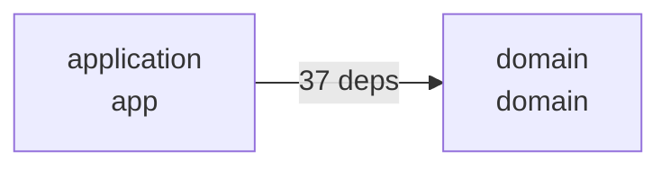

# Référence CLI MINOS

Le launcher stable est `com.minos.cli.MinosLauncher`.

Installation native :

```powershell
minos.cmd <commande>
```

Checkout source :

```powershell
java -jar .\target\minos-code-intelligence-0.2.0-SNAPSHOT-all.jar <commande>
```

`--help` reste la source de vérité exécutable.

## Formats de sortie

La plupart des commandes qui acceptent `--format` proposent deux représentations du **même résultat métier** :

- `text` : sortie compacte destinée à être lue directement dans un terminal ; c'est le format par défaut ;
- `json` : sortie structurée destinée aux scripts PowerShell, à la CI, aux intégrations et aux clients MCP.

`--format <text|json>` dans la syntaxe signifie donc : remplacer `<text|json>` par **une seule** des valeurs `text` ou `json`.

Exemples équivalents :

```powershell
# Format texte implicite : lisible par un humain
minos.cmd architecture my-project

# Même format demandé explicitement
minos.cmd architecture my-project --format text

# Format structuré : destiné aux outils et scripts
minos.cmd architecture my-project --format json
```

La commande `architecture` ajoute deux formats de graphe :

```text
--format <text|json|mermaid|dot>
```

- `mermaid` : graphe `flowchart` directement intégrable dans Markdown/GitHub/les outils compatibles Mermaid ;
- `dot` : graphe Graphviz DOT permettant de produire SVG, PNG ou PDF avec Graphviz.

Exemple représentatif de sortie `text` pour `architecture` :

```text
project: my-project (<project-id>)
snapshot: <snapshot-id>
modules: 3
languages: [JAVA]
buildSystems: [MAVEN]
symbols: local=1240, external=317
relationships: 2861
dependencies: total=842, inter=94, intra=731, unassigned=17
moduleEdges: 8
topIncomingModules: [<module-id>]
topOutgoingModules: [<module-id>]
technologies: [JAVA, MAVEN]
```

La sortie `json` expose des champs nommés et, pour `architecture`, la **liste réelle des arêtes agrégées entre modules** :

```json
{
  "projectId": "<project-id>",
  "projectName": "my-project",
  "snapshotId": "<snapshot-id>",
  "nature": "DERIVED",
  "languages": ["JAVA"],
  "buildSystems": ["MAVEN"],
  "moduleCount": 3,
  "localSymbolCount": 1240,
  "externalSymbolCount": 317,
  "relationshipCount": 2861,
  "dependencies": {
    "total": 842,
    "interModule": 94,
    "intraModule": 731,
    "unassigned": 17,
    "moduleEdges": 8
  },
  "topIncomingModuleIds": ["<module-id>"],
  "topOutgoingModuleIds": ["<module-id>"],
  "technologies": ["JAVA", "MAVEN"],
  "modules": [],
  "moduleDependencies": [
    {
      "id": "<edge-id>",
      "sourceModuleId": "<source-module-id>",
      "sourceModuleName": "application",
      "targetModuleId": "<target-module-id>",
      "targetModuleName": "domain",
      "dependencyCount": 37,
      "sourceSymbolCount": 12,
      "targetSymbolCount": 9,
      "sampleDependencyIds": ["<relationship-id>"],
      "nature": "DERIVED",
      "confidence": 1.0,
      "evidence": []
    }
  ]
}
```

Les valeurs ci-dessus sont illustratives ; la structure correspond à la surface actuelle de la commande.

Exemple PowerShell :

```powershell
$architecture = minos.cmd architecture my-project --format json | ConvertFrom-Json

$architecture.moduleCount
$architecture.dependencies.interModule
$architecture.moduleDependencies
```

Pour enregistrer le résultat :

```powershell
minos.cmd architecture my-project --format json |
  Set-Content .\architecture.json -Encoding utf8
```

Le serveur MCP MINOS utilise lui-même la surface CLI JSON pour ses vues structurées.

## Administration

```text
project add <path> [--name <name>] [--format <text|json>]
project list [--format <text|json>]
project inspect <project> [--format <text|json>]
inspect <project> [--format <text|json>]
index-status <project> [--format <text|json>]
```

## Diagnostic runtime

```text
doctor [--format <text|json>]
tools list [--format <text|json>]
tools verify [--format <text|json>]
tools install <provider> [--format <text|json>]
```

`doctor` retourne `1` lorsqu'une action est requise pour obtenir tous les runtimes providers gérés.

## Indexation autonome

```text
index <project> [options]
```

Options :

```text
--provider <id>       override de négociation
--force-full          exécution FULL explicite
--dry-run             calculer le plan sans lancer le provider
--format <text|json>
```

Exemples :

```powershell
minos.cmd index nexus --dry-run
minos.cmd index nexus
minos.cmd index nexus --force-full --format json
```

Le plan expose le provider, son runtime, la portée et les raisons.

### Compatibilité M9

Pendant la transition M14, cette forme reste acceptée avec warning :

```text
index <project> --scip <index.scip> --provider <id>
```

Préférer désormais `import-scip`.

## Import SCIP manuel

```text
import-scip <project> --file <index.scip> --provider <id> [options]
```

Options :

```text
--provider-version <version>
--module <module>
--snapshot <id>
--format <text|json>
```

## Recherche contextuelle

```text
search <project> <query> [options]
```

Options principales :

```text
--qualified-name <name>
--kind <kind>
--module <module>
--limit <1..20>              défaut 5
--depth <0..3>               défaut 1
--usages <0..50>             défaut 3
--relationships <0..50>      défaut 10
--context-lines <0..50>      défaut 2
--max-tokens <count>         défaut 4000
--no-source
--format <text|json>
```

## Symboles et sources

```text
find-symbol <project> <symbol> [options]
get-source <project> <file-id> [--format <text|json>]
find-usages <project> <symbol-id> [--limit <count>] [--format <text|json>]
```

## Relations

```text
find-implementations <project> <symbol-id>
find-callers <project> <symbol-id>
find-callees <project> <symbol-id>
dependencies <project> <symbol-id>
dependents <project> <symbol-id>
related-tests <project> <symbol-id>
```

Une liste vide signifie qu'aucune relation correspondante n'est présente dans le snapshot observé ; elle ne prouve pas une absence runtime.

## Architecture et visualisation du graphe

```text
architecture <project> [--module <module>] [--format <text|json|mermaid|dot>]
```

MINOS dérive un **graphe orienté de dépendances inter-modules** à partir du snapshot actif. Une arête :

```text
module A ──N dépendances──> module B
```

signifie que le snapshot contient `N` dépendances agrégées depuis des symboles du module A vers des symboles du module B.

Le graphe n'est pas une supposition d'interface utilisateur : les arêtes rendues proviennent directement de `ArchitectureDependencyGraph.dependencies()`.

### Voir les arêtes en JSON

```powershell
minos.cmd architecture my-project --format json |
  ConvertFrom-Json |
  Select-Object -ExpandProperty moduleDependencies
```

Chaque arête fournit notamment source, cible, nombre de dépendances, nombres de symboles, échantillons de relations, nature et confiance.

### Produire un diagramme Mermaid

```powershell
minos.cmd architecture my-project --format mermaid |
  Set-Content .\architecture.mmd -Encoding utf8
```

Exemple de rendu produit :



Le contenu peut être placé dans un bloc `mermaid` Markdown ou ouvert dans n'importe quel renderer Mermaid compatible.

### Produire un graphe Graphviz DOT

```powershell
minos.cmd architecture my-project --format dot |
  Set-Content .\architecture.dot -Encoding utf8
```

Avec Graphviz installé :

```powershell
dot -Tsvg .\architecture.dot -o .\architecture.svg
dot -Tpng .\architecture.dot -o .\architecture.png
```

Graphviz n'est **pas** requis par MINOS : MINOS génère le DOT, et Graphviz ne sert qu'au rendu graphique.

### Se concentrer sur un module

Avec un format graphique, `--module` conserve le module choisi et ses voisins directs entrants/sortants :

```powershell
minos.cmd architecture my-project `
  --module packages/api `
  --format mermaid
```

Cela évite de produire un diagramme illisible sur un gros projet.

Pour la vue métier compacte d'un module :

```powershell
minos.cmd architecture my-project --module packages/api --format json
```

## Impact

```text
impact <project> <symbol-id> [--depth <1..32>] [--limit <1..10000>] [--format <text|json>]
```

L'impact reste une estimation potentielle fondée sur le graphe observé.

## NEXUS

```text
nexus-export --root <project-root>
```

Le JSON versionné est écrit sur stdout.

## MCP

Le launcher système accepte :

```text
minos mcp
```

Cette commande bloque volontairement sur une session MCP STDIO jusqu'à fermeture par le client.

Le MCP expose également `minos_architecture_graph`, qui peut demander le graphe en `json`, `mermaid` ou `dot`.

Voir [Serveur MCP](mcp.md) pour les configurations concrètes de clients MCP.

## Version

```text
minos --version
```

Dans un artefact packagé, la version est lue dans le manifest du JAR afin d'être identique à celle de la release.

## Codes de sortie

```text
0  succès
1  erreur d'exécution / diagnostic action requise
2  erreur d'usage
```

En automatisation : utiliser `--format json` et tester le code de sortie avant de consommer stdout.
