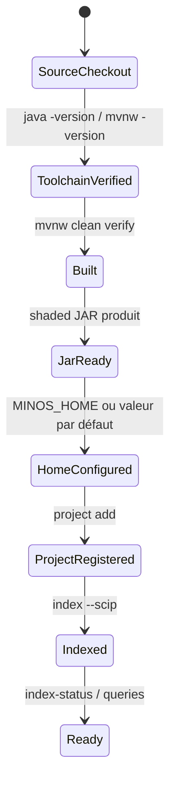

# Installation et mise en route

## Prérequis

MINOS impose :

```text
Java    24.x uniquement
Maven   3.9.x
OS      Windows, Linux ou macOS tant que le JDK 24 est disponible
```

Le `pom.xml` applique explicitement :

```text
Java [24,25)
Maven [3.9,4.0)
```

Le projet fournit un Maven Wrapper. Sous Windows, il est donc recommandé d’utiliser `mvnw.cmd` plutôt qu’un Maven système non maîtrisé.

## Vérifier la toolchain

PowerShell :

```powershell
java -version
.\mvnw.cmd -version
```

Le runtime Maven doit lui aussi être Java 24.

## Construire MINOS

Validation complète :

```powershell
.\mvnw.cmd clean verify
```

Packaging simple :

```powershell
.\mvnw.cmd clean package
```

Artefacts principaux :

```text
target/minos-code-intelligence-0.1.0-SNAPSHOT.jar
target/minos-code-intelligence-0.1.0-SNAPSHOT-all.jar
```

Le JAR `-all.jar` contient les dépendances nécessaires à la CLI et au serveur MCP.

## Lancer la CLI

```powershell
java -jar .\target\minos-code-intelligence-0.1.0-SNAPSHOT-all.jar --help
```

Le `Main-Class` du JAR est :

```text
com.minos.cli.MinosLauncher
```

## Home MINOS

MINOS persiste son registre et ses snapshots dans un répertoire de données appelé **MINOS_HOME**.

Ordre de résolution :

```text
-Dminos.home=<path>
        ↓
MINOS_HOME=<path>
        ↓
<user.home>/.minos
```

### Avec une variable d’environnement

```powershell
$env:MINOS_HOME = 'N:\minos-data'
java -jar .\target\minos-code-intelligence-0.1.0-SNAPSHOT-all.jar project list
```

### Avec une propriété JVM

```powershell
java -Dminos.home=N:\minos-data `
  -jar .\target\minos-code-intelligence-0.1.0-SNAPSHOT-all.jar project list
```

La propriété JVM est prioritaire sur la variable d’environnement.

## Organisation logique des données

Le bootstrap CLI ouvre notamment :

```text
<MINOS_HOME>/registry
<MINOS_HOME>/symbol-snapshots
```

Ne pas éditer manuellement les fichiers de ces répertoires pendant que MINOS les utilise.

## Premier projet

```powershell
$minos = 'N:\workspace-dev\minos-code-intelligence\target\minos-code-intelligence-0.1.0-SNAPSHOT-all.jar'

java -jar $minos project add N:\workspace-dev\my-project --name my-project
java -jar $minos project list
java -jar $minos inspect my-project
```

## Premier snapshot SCIP

Préparer d’abord `index.scip` avec l’indexeur adapté au projet, puis :

```powershell
java -jar $minos index my-project `
  --scip N:\workspace-dev\my-project\index.scip `
  --provider scip-typescript `
  --provider-version 0.4.0
```

Vérifier ensuite :

```powershell
java -jar $minos index-status my-project
```

## Cycle d’installation



## Mettre à jour une installation locale

Après un changement de version :

```powershell
git pull --ff-only
.\mvnw.cmd clean verify
```

Conserver `MINOS_HOME` permet de réutiliser le registre et les snapshots existants lorsque leur format reste compatible avec la version utilisée.

## Installation pour un client MCP

Le client MCP doit lancer explicitement :

```text
java -cp <minos-all.jar> com.minos.mcp.MinosMcpServer
```

Voir [mcp.md](mcp.md).
