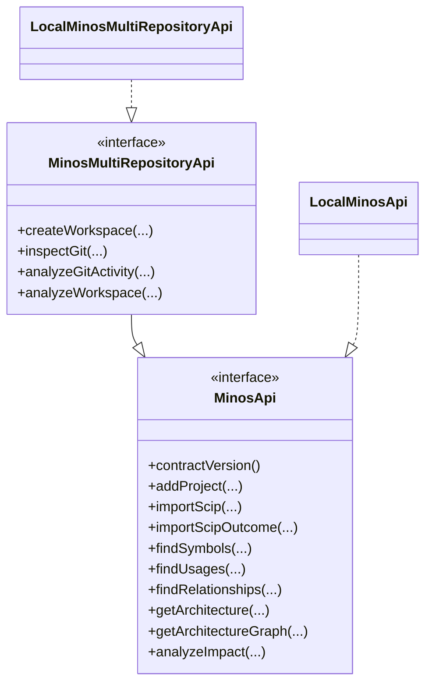

# Utiliser l’API Java locale

MINOS expose une API Java publique pour les consommateurs qui s’exécutent dans la même JVM ou dans une application locale intégrant le JAR MINOS.

## Contrats

```text
com.minos.api.MinosApi
com.minos.api.MinosMultiRepositoryApi
```

Versions :

```text
MinosApi.CONTRACT_VERSION = 1
MinosMultiRepositoryApi.MULTI_REPOSITORY_CONTRACT_VERSION = 1
```

Les ajouts au contrat v1 sont **additifs** : `getArchitectureGraph(...)`, `team()` et `importScipOutcome(...)` sont des `default methods`, afin de ne pas casser les implémentations tierces existantes. `LocalMinosApi` fournit l'implémentation complète, et `LocalMinosMultiRepositoryApi` redélègue **toutes** les opérations `MinosApi` : une façade plus riche ne perd jamais une capacité de la façade qu'elle étend (invariant vérifié par réflexion en test).

## Implémentations locales

Pour le contrat M11 :

```java
import com.minos.api.LocalMinosApi;
import com.minos.api.MinosApi;

import java.nio.file.Path;

MinosApi minos = new LocalMinosApi(Path.of("N:/minos-data"));
System.out.println(minos.contractVersion());
```

Le `Path` fourni est le home MINOS, pas la racine du projet analysé.

## Enregistrer un projet

```java
MinosApi.ProjectDto project = minos.addProject(
        Path.of("N:/workspace-dev/my-project"),
        "my-project"
);
```

## Importer un SCIP

```java
MinosApi.IndexImportRequest request = new MinosApi.IndexImportRequest(
        "scip-typescript",
        "0.4.0",
        null,
        null
);

MinosApi.IndexImportDto imported = minos.importScip(
        project.id(),
        Path.of("N:/workspace-dev/my-project/index.scip"),
        request
);
```

### Connaître l'état de commit du snapshot

`importScip(...)` répond « ce qui a été importé ». Un import peut être **committé et autoritatif** alors que l'acquittement de durabilité ou la réparation des métadonnées projet est encore en attente : c'est un fait distinct du succès, et un consommateur qui automatise autour de l'import (re-vérification planifiée, promotion différée, avertissement à l'utilisateur) doit pouvoir le voir.

```java
MinosApi.IndexImportOutcomeDto outcome = minos.importScipOutcome(
        project.id(),
        Path.of("N:/workspace-dev/my-project/index.scip"),
        request
);

switch (outcome.commitStatus()) {
    case COMMITTED -> { /* durable et métadonnées à jour */ }
    case COMMITTED_DURABILITY_PENDING -> { /* autoritatif, acquittement en attente */ }
    case COMMITTED_METADATA_PENDING -> { /* autoritatif, réparation métadonnées en attente */ }
    case COMMITTED_DURABILITY_AND_METADATA_PENDING -> { /* les deux */ }
}

if (outcome.durabilityAcknowledgementPending() || outcome.metadataRecoveryPending()) {
    System.err.println(outcome.diagnostic());
}
```

`outcome.index()` est **exactement** le `IndexImportDto` que `importScip(...)` aurait retourné. Le `diagnostic` est optionnel (`null` s'il n'y en a pas) et traverse la même politique de redaction publique que les messages d'erreur : ni chemin absolu, ni URL de connexion, ni secret.

**Compatibilité.** L'ajout est additif : `importScipOutcome(...)` est un `default method` du contrat v1, `importScip(...)` est inchangé, aucun record public existant n'a été modifié et `MinosApi.CONTRACT_VERSION` reste `1`. Une implémentation tierce écrite pour le contrat v1 compile et s'exécute sans modification ; par défaut elle répond `UNAVAILABLE` sur la nouvelle opération plutôt que d'annoncer `COMMITTED`, une capacité qu'elle n'a pas.

## Rechercher des symboles

```java
var symbols = minos.findSymbols(
        project.id(),
        MinosApi.SymbolQuery.lexical("GreetingPort", 20)
);
```

Une requête avancée peut filtrer par qualified name, kind et module.

## Usages et relations

```java
String symbolId = symbols.getFirst().id();

var usages = minos.findUsages(project.id(), symbolId, 100);

var outgoing = minos.findRelationships(
        project.id(),
        MinosApi.RelationshipQuery.outgoingSymbol(
                symbolId,
                java.util.Set.of("DEPENDS_ON"),
                100
        )
);
```

## Architecture

Vue agrégée :

```java
MinosApi.ArchitectureDto architecture = minos.getArchitecture(project.id());
```

Elle expose notamment les modules, langages, builds, compteurs de dépendances, modules centraux relatifs et technologies observées.

### Graphe de dépendances inter-modules

Pour obtenir les **arêtes réelles** agrégées par MINOS :

```java
MinosApi.ArchitectureGraphDto graph = minos.getArchitectureGraph(project.id());

System.out.println(graph.moduleCount());
System.out.println(graph.edgeCount());

for (MinosApi.ArchitectureDependencyDto edge : graph.dependencies()) {
    System.out.printf(
            "%s -> %s : %d dépendances%n",
            edge.sourceModuleName(),
            edge.targetModuleName(),
            edge.dependencyCount()
    );
}
```

Une arête contient notamment :

```text
id
sourceModuleId / sourceModuleName
targetModuleId / targetModuleName
dependencyCount
sourceSymbolCount
targetSymbolCount
sampleDependencyIds
nature
confidence
```

Le graphe expose uniquement les dépendances observées et dérivées du snapshot actif ; aucune arête n'est inventée pour compléter la topologie.

Pour un rendu Mermaid ou Graphviz DOT, utiliser la CLI `architecture --format mermaid|dot` ou le tool MCP `minos_architecture_graph`.

## Impact

```java
MinosApi.ImpactReportDto impact = minos.analyzeImpact(
        project.id(),
        MinosApi.ImpactQuery.defaults(symbolId)
);
```

Le rapport doit être interprété comme un impact **potentiel** fondé sur le graphe observé.

## Erreurs

Toutes les opérations publiques utilisent `MinosApiException` avec un code stable :

```text
INVALID_REQUEST
UNAVAILABLE
IO_FAILURE
EXECUTION_FAILURE
```

Exemple :

```java
try {
    minos.getProject("unknown");
} catch (MinosApi.MinosApiException exception) {
    System.err.println(exception.code() + ": " + exception.getMessage());
}
```

## Multi-dépôts et Git

`MinosMultiRepositoryApi` ajoute workspaces, Git et relations cross-repository tout en étendant `MinosApi`.

Principales opérations :

```text
createWorkspace
listWorkspaces
getWorkspace
assignProjectToWorkspace
inspectGit
analyzeGitActivity
analyzeWorkspace
```

Les limites sont validées dans les DTOs publics : jusqu’à 10 000 commits/fichiers/relations selon la requête et profondeur de zone Git 1..8.

## Architecture du contrat



## Garantie de découplage

Les signatures publiques utilisent uniquement des types JDK et les DTOs des interfaces publiques. Un consommateur n’a pas besoin de dépendre directement des modèles SCIP, JGit, MCP ou des classes internes de domaine.

Pour les détails d’architecture, voir [../developer/public-surfaces.md](../developer/public-surfaces.md).
