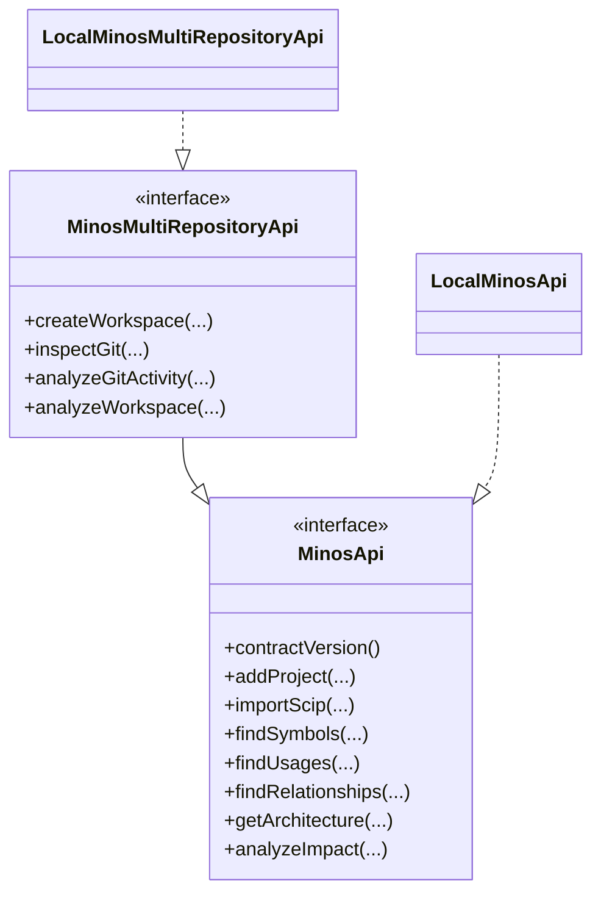

# Utiliser l’API Java locale

MINOS expose une API Java publique pour les consommateurs qui s’exécutent dans la même JVM ou dans une application locale intégrant le JAR MINOS.

## Contrats

```text
com.minos.api.MinosApi
com.minos.api.MinosMultiRepositoryApi
```

Versions :

```text
MinosApi.CONTRACT_VERSION = 1
MinosMultiRepositoryApi.MULTI_REPOSITORY_CONTRACT_VERSION = 1
```

## Implémentations locales

Pour le contrat M11 :

```java
import com.minos.api.LocalMinosApi;
import com.minos.api.MinosApi;

import java.nio.file.Path;

MinosApi minos = new LocalMinosApi(Path.of("N:/minos-data"));
System.out.println(minos.contractVersion());
```

Le `Path` fourni est le home MINOS, pas la racine du projet analysé.

## Enregistrer un projet

```java
MinosApi.ProjectDto project = minos.addProject(
        Path.of("N:/workspace-dev/my-project"),
        "my-project"
);
```

## Importer un SCIP

```java
MinosApi.IndexImportRequest request = new MinosApi.IndexImportRequest(
        "scip-typescript",
        "0.4.0",
        null,
        null
);

MinosApi.IndexImportDto imported = minos.importScip(
        project.id(),
        Path.of("N:/workspace-dev/my-project/index.scip"),
        request
);
```

## Rechercher des symboles

```java
var symbols = minos.findSymbols(
        project.id(),
        MinosApi.SymbolQuery.lexical("GreetingPort", 20)
);
```

Une requête avancée peut filtrer par qualified name, kind et module.

## Usages et relations

```java
String symbolId = symbols.getFirst().id();

var usages = minos.findUsages(project.id(), symbolId, 100);

var outgoing = minos.findRelationships(
        project.id(),
        MinosApi.RelationshipQuery.outgoingSymbol(
                symbolId,
                java.util.Set.of("DEPENDS_ON"),
                100
        )
);
```

## Architecture

```java
MinosApi.ArchitectureDto architecture = minos.getArchitecture(project.id());
```

La vue expose notamment les modules, langages, builds, dépendances, modules centraux relatifs et technologies observées.

## Impact

```java
MinosApi.ImpactReportDto impact = minos.analyzeImpact(
        project.id(),
        MinosApi.ImpactQuery.defaults(symbolId)
);
```

Le rapport doit être interprété comme un impact **potentiel** fondé sur le graphe observé.

## Erreurs

Toutes les opérations publiques utilisent `MinosApiException` avec un code stable :

```text
INVALID_REQUEST
UNAVAILABLE
IO_FAILURE
EXECUTION_FAILURE
```

Exemple :

```java
try {
    minos.getProject("unknown");
} catch (MinosApi.MinosApiException exception) {
    System.err.println(exception.code() + ": " + exception.getMessage());
}
```

## Multi-dépôts et Git

`MinosMultiRepositoryApi` ajoute workspaces, Git et relations cross-repository tout en étendant `MinosApi`.

Principales opérations :

```text
createWorkspace
listWorkspaces
getWorkspace
assignProjectToWorkspace
inspectGit
analyzeGitActivity
analyzeWorkspace
```

Les limites sont validées dans les DTOs publics : jusqu’à 10 000 commits/fichiers/relations selon la requête et profondeur de zone Git 1..8.

## Architecture du contrat



## Garantie de découplage

Les signatures publiques utilisent uniquement des types JDK et les DTOs des interfaces publiques. Un consommateur n’a pas besoin de dépendre directement des modèles SCIP, JGit, MCP ou des classes internes de domaine.

Pour les détails d’architecture, voir [../developer/public-surfaces.md](../developer/public-surfaces.md).
