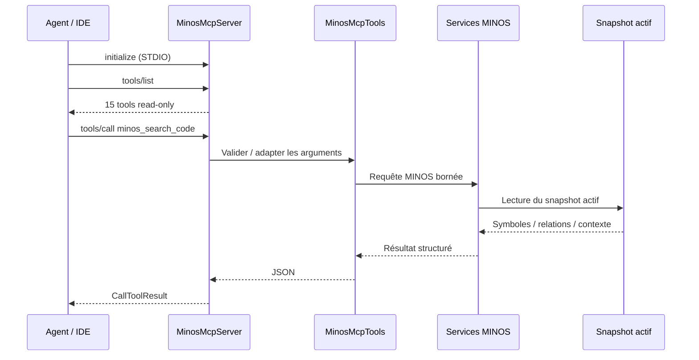

# Utiliser MINOS via MCP

MINOS expose un serveur **Model Context Protocol** local via STDIO. Il permet à un IDE, un agent ou un orchestrateur compatible MCP de consommer la Code Intelligence sans parser la CLI.

## Lancer le serveur

Construire d’abord le shaded JAR :

```powershell
.\mvnw.cmd clean package
```

Puis :

```powershell
java -cp .\target\minos-code-intelligence-0.1.0-SNAPSHOT-all.jar `
  com.minos.mcp.MinosMcpServer
```

Le serveur utilise le même `MINOS_HOME` que la CLI.

## Architecture d’utilisation



## Catalogue des 15 tools

| Tool | Usage |
|---|---|
| `minos_project_structure` | structure, langages, builds, état et snapshot |
| `minos_index_status` | état d’index et métadonnées |
| `minos_search_code` | contexte de code compact |
| `minos_find_symbols` | recherche de symboles |
| `minos_find_usages` | usages résolus |
| `minos_find_implementations` | implémentations |
| `minos_find_callers` | appels entrants disponibles |
| `minos_find_callees` | appels sortants disponibles |
| `minos_dependencies` | dépendances sortantes |
| `minos_dependents` | dépendances entrantes |
| `minos_related_tests` | tests liés avec explications |
| `minos_symbol_context` | contexte compact d’un symbole |
| `minos_module_context` | contexte architectural d’un module |
| `minos_architecture` | vue d’architecture projet |
| `minos_impact` | impact potentiel d’un symbole |

Tous les tools sont **read-only**. Le serveur MCP ne permet ni `project add` ni import SCIP.

## Configuration conceptuelle d’un client MCP

La syntaxe exacte dépend du client. Le processus à enregistrer est :

```text
command = <java 24>
args    = -cp <minos-all.jar> com.minos.mcp.MinosMcpServer
env     = MINOS_HOME=<home MINOS>
```

Exemple JSON conceptuel sous Windows :

```json
{
  "mcpServers": {
    "minos": {
      "command": "C:\\Program Files\\Java\\jdk-24\\bin\\java.exe",
      "args": [
        "-cp",
        "N:\\workspace-dev\\minos-code-intelligence\\target\\minos-code-intelligence-0.1.0-SNAPSHOT-all.jar",
        "com.minos.mcp.MinosMcpServer"
      ],
      "env": {
        "MINOS_HOME": "N:\\minos-data"
      }
    }
  }
}
```

## Configurations IntelliJ DEV et PROD

Le dépôt fournit huit configurations partagées dans `.run/`. Elles utilisent
Windows PowerShell directement et ne nécessitent ni commande POSIX `export` ni
chemin de JDK codé en dur :

- `[MINOS Dev] MCP` détecte un JDK 24, reconstruit le JAR et utilise
  `target/minos-dev-home` ;
- `[MINOS Prod] Install` construit l'image Docker Java 24 sous
  `%LOCALAPPDATA%\MINOS` et exécute un vrai handshake MCP ;
- `[MINOS Prod] Start` démarre le conteneur persistant en arrière-plan ;
- `[MINOS Prod] MCP` ouvre une session STDIO dans ce conteneur avec
  `docker exec -i` ;
- `Status`, `Validate` et `Stop` contrôlent l'installation sans supprimer les
  données ;
- `[MINOS] Verify launch configs` contrôle les XML, PowerShell et Compose.

Les mêmes opérations sont disponibles hors IntelliJ :

```powershell
.\docker\scripts\prod-mcp.ps1 -Action Install
.\docker\scripts\prod-mcp.ps1 -Action Start
.\docker\scripts\prod-mcp.ps1 -Action Attach
.\docker\scripts\prod-mcp.ps1 -Action Status
.\docker\scripts\prod-mcp.ps1 -Action Validate
.\docker\scripts\prod-mcp.ps1 -Action Stop
```

Le runtime Docker n'expose aucun port et utilise `network_mode: none`. Le home
`%LOCALAPPDATA%\MINOS\data` est monté en lecture/écriture ; la racine des projets
est montée dans `/workspace/projects` en lecture seule. Le conteneur reste actif
entre deux sessions STDIO.

## Contraintes importantes

Le serveur utilise **stdout pour MCP**. Ne pas entourer le lancement d’un script qui écrit des messages de diagnostic sur stdout.

Les entrées sont bornées par schema. Parmi les limites principales :

```text
search limit          1..20
symbol/relation limit 1..1000
search depth          0..3
usages                0..50
relationships         0..50
context lines         0..50
impact depth          1..32
impact limit          1..10000
```

Les clés inconnues sont rejetées par les schemas MCP plutôt qu’ignorées silencieusement.

## Préparer les données avant MCP

Le serveur ne réalise pas l’indexation. Avant de le démarrer :

```powershell
java -jar $minos project add <project-root> --name my-project
java -jar $minos index my-project --scip <index.scip> --provider <provider>
```

Le client MCP peut ensuite interroger le snapshot actif.

## Erreurs

Une erreur MINOS devient un `CallToolResult` en erreur. Les erreurs de schema sont généralement rejetées avant l’appel du handler.

Pour diagnostiquer un problème de données, reproduire d’abord la requête équivalente avec la CLI et `--format json`.

## Limites de la surface MCP

Le serveur MCP ne revendique pas :

- de transport HTTP distant ;
- d’authentification réseau ;
- de mutation ;
- d’indexation automatique ;
- de garantie d’exhaustivité supérieure au snapshot MINOS.

Pour les détails d’implémentation, voir [../developer/public-surfaces.md](../developer/public-surfaces.md).
