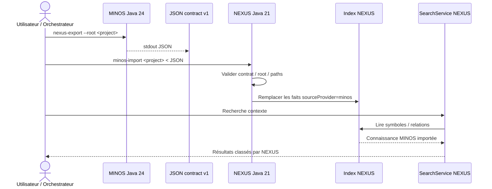

# Intégration MINOS → NEXUS

MINOS et NEXUS ont des responsabilités distinctes :

```text
MINOS  = faits de Code Intelligence
NEXUS  = recherche contextuelle, ranking, sélection et budget
```

La frontière M13 transporte un document JSON versionné. MINOS n’intègre aucun type NEXUS dans son modèle public.

## Flux recommandé



## Côté MINOS

Commande :

```powershell
java -jar $minos nexus-export --root N:\workspace-dev\my-project
```

Pour écrire dans un fichier :

```powershell
java -jar $minos nexus-export --root N:\workspace-dev\my-project `
  > N:\temp\minos-export.json
```

Le contrat courant expose :

```text
contractVersion = 1
producer        = MINOS
```

Le document contient :

- l’identité du projet et du snapshot actif ;
- les symboles locaux exportables ;
- les chemins relatifs sûrs ;
- les kinds, noms, qualified names, signatures et langues ;
- les relations locales résolues ;
- la nature de l’information ;
- la confiance lorsqu’elle existe ;
- l’origine et les preuves ;
- les limitations de projection.

## Préconditions

`nexus-export` exige :

1. que la racine corresponde à un projet enregistré dans MINOS ;
2. qu’un snapshot MINOS actif existe ;
3. que les fichiers exportés puissent être rattachés de façon sûre à la racine du projet.

Exemple de préparation :

```powershell
java -jar $minos project add N:\workspace-dev\my-project --name my-project
java -jar $minos index my-project `
  --scip N:\workspace-dev\my-project\index.scip `
  --provider scip-typescript
```

## Résolution des identités de fichiers

Un `fileId` MINOS n’est pas nécessairement un chemin. L’adaptateur SCIP peut produire une identité stable de la forme :

```text
file:<sha256(projectId + US + relativePath)>
```

L’export M13 reconstruit le chemin relatif à partir des fichiers réels du projet et de la même fonction d’identité. Un identifiant impossible à rattacher n’est pas transformé en faux chemin.

## Limitations possibles

Le contrat peut signaler notamment :

```text
SYMBOLS_TRUNCATED
RELATIONS_TRUNCATED
FILE_PATH_DISCOVERY_TRUNCATED
UNRESOLVED_FILE_IDS
EXTERNAL_SYMBOLS_OMITTED
SYMBOL_WITHOUT_LOCAL_LOCATION_OMITTED
UNRESOLVED_SYMBOL_FILE_ID_OMITTED
NON_SYMBOL_RELATIONS_OMITTED
NON_LOCAL_RELATIONS_OMITTED
UNRESOLVED_RELATION_FILE_ID_OMITTED
```

Une limitation signifie que l’export ne doit pas être considéré comme exhaustif sur ce point.

## Consommation par NEXUS

Sur la branche d’intégration NEXUS M13, l’import est explicite :

```text
nexus minos-import <project> < minos-export.json
```

Cette commande appartient à NEXUS, pas à MINOS. Le cœur MINOS reste indépendant de son consommateur.

Le design courant évite que NEXUS pilote un processus MINOS : le shell, l’IDE, JARVIS ou un script d’orchestration réalise l’échange stdout/stdin.

## Exemple PowerShell de bout en bout

```powershell
$minosJar = 'N:\workspace-dev\minos-code-intelligence\target\minos-code-intelligence-0.1.0-SNAPSHOT-all.jar'
$export = 'N:\temp\minos-export.json'

# JVM 24
& 'C:\path\to\jdk-24\bin\java.exe' -jar $minosJar `
  nexus-export --root N:\workspace-dev\my-project > $export

# Puis importer le fichier avec la CLI NEXUS Java 21.
# La commande exacte dépend du packaging NEXUS utilisé.
```

## Garanties de frontière

MINOS ne fournit pas à NEXUS :

- de ranking ;
- de budget de tokens ;
- de `ContextBundle` ;
- de décision sur le contexte final ;
- de serveur réseau obligatoire.

NEXUS peut ignorer les kinds qu’il ne sait pas représenter ; il ne doit pas leur inventer une sémantique différente.

## Dépannage

### `project root is not registered`

Enregistrer la racine avec `project add` ou utiliser exactement la racine canonique enregistrée.

### `project has no active MINOS knowledge snapshot`

Importer un SCIP avec `index` avant l’export.

### Export vide ou partiel

Consulter `limitations` dans le JSON, puis vérifier les emplacements des symboles et les `fileId` du snapshot.

Pour l’architecture développeur du contrat, voir [../developer/public-surfaces.md](../developer/public-surfaces.md).
