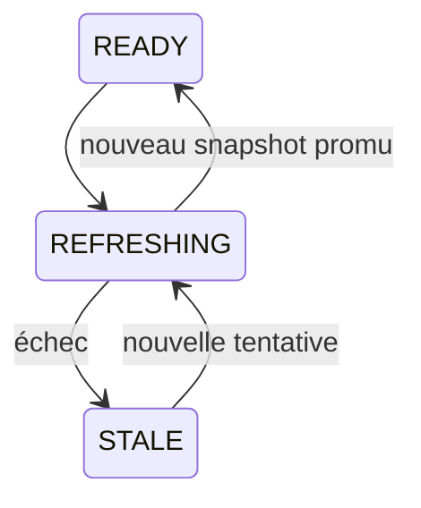

# Dépannage

Ce guide couvre l’installation native M14, les providers, l’indexation autonome, les snapshots, MCP et NEXUS.

## Commencer par `doctor`

Pour une installation utilisateur :

```powershell
minos.cmd doctor
```

Pour un checkout source :

```powershell
.\minos.cmd doctor
```

Le diagnostic indique le runtime MINOS, les commandes projet disponibles et l’état de chaque provider géré.

## `BUILD FAILURE` lors du développement de MINOS

Ce cas concerne le checkout source :

```powershell
java -version
.\mvnw.cmd -version
```

Le développement de MINOS exige Java 24 et Maven 3.9.x via le wrapper.

Une distribution installée embarque son propre runtime et n’exige pas un JDK système pour exécuter la CLI/MCP.

## `project root is not registered`

Diagnostic :

```powershell
minos.cmd project list
minos.cmd inspect <project>
```

Correction :

```powershell
minos.cmd project add <root> --name <name>
```

## Projet enregistré mais racine indisponible

`inspect` expose `rootAvailable`.

Si la racine a été déplacée, si une lettre de lecteur a changé ou si un volume n’est plus monté, MINOS conserve l’identité enregistrée mais ne peut plus découvrir/lire le projet.

Réenregistrer le bon projet ou rétablir exactement la racine attendue.

## `index` échoue avant de lancer le provider

Exécuter :

```powershell
minos.cmd index <project> --dry-run --format json
minos.cmd doctor --format json
minos.cmd tools list --format json
```

Causes typiques :

- aucun provider qualifié pour le langage/build détecté ;
- runtime provider non installé ;
- `JAVA_HOME` absent ou ne contenant pas `javac` pour `scip-java` ;
- `node`/`npm` absents pour `scip-typescript` ;
- configuration projet non supportée par la qualification courante.

Installer un provider :

```powershell
minos.cmd tools install scip-java
# ou
minos.cmd tools install scip-typescript
```

## `scip-java` est `BLOCKED`

`scip-java` utilise le JDK du projet, pas le runtime Java embarqué de MINOS.

Vérifier :

```powershell
$env:JAVA_HOME
& "$env:JAVA_HOME\bin\javac.exe" -version
```

Puis relancer :

```powershell
minos.cmd doctor
minos.cmd index <project> --dry-run
```

Le périmètre M14 initial qualifie le provider Java sur Maven. Un projet hors de ce périmètre doit rester explicitement non couvert plutôt que recevoir une fausse garantie.

## `scip-typescript` est `BLOCKED`

Vérifier :

```powershell
node --version
npm --version
```

MINOS installe le provider, **pas les dépendances métier du projet**.

Si `node_modules` ou les dépendances nécessaires au projet sont absentes, les préparer selon le workflow normal du projet avant `minos index`.

## Provider installé mais indexation échoue

Chaque run conserve ses diagnostics sous :

```text
<MINOS_HOME>/runs/<runId>/<provider>/
```

Consulter :

```text
provider.stdout.log
provider.stderr.log
process.txt
failed-index.scip   # uniquement s’il existe
```

Le message CLI indique le `runId` ou le fichier de log lorsque cela est disponible.

## Un `index.scip` existant dans le projet a disparu

Le runtime M14 est conçu pour préserver/restaurer un `index.scip` préexistant autour de l’exécution provider.

Si ce contrat semble violé, ne relancer pas plusieurs indexations en parallèle. Conserver le répertoire `<MINOS_HOME>/runs/<runId>` et signaler le SHA exact de MINOS.

## Import manuel d’un artefact SCIP

Pour diagnostiquer un artefact externe sans lancer le provider :

```powershell
minos.cmd import-scip <project> `
  --file <index.scip> `
  --provider <provider-id> `
  --format json
```

La forme historique `index --scip` reste temporairement acceptée mais est dépréciée.

## `NO_CHANGES`

Ce résultat signifie que le fingerprint courant correspond à la baseline active et que le planner M7 a choisi `NONE`.

Pour forcer une requalification :

```powershell
minos.cmd index <project> --force-full
```

## Pourquoi MINOS fait `FULL` pour une petite modification ?

C’est volontaire lorsque le provider sélectionné ne possède pas une capacité `INCREMENTAL_INDEXING` explicitement qualifiée.

M14 n’invente pas un incrémental que le fournisseur ne prouve pas.

## `STALE`

`STALE` signifie qu’un refresh a échoué mais qu’un ancien snapshot actif reste disponible :



Les requêtes peuvent continuer à lire l’ancien snapshot. Corriger la cause provider/build puis relancer `index`.

## `FAILED`

`FAILED` signifie qu’aucun snapshot actif utilisable n’existe après un échec initial.

Corriger `doctor`/provider/build puis relancer l’indexation.

## Le workspace a changé pendant l’indexation

MINOS compare un fingerprint avant/après le run.

Si le workspace change pendant l’exécution, le fingerprint baseline n’est pas promu. Le prochain `index` replanifiera conservativement le projet.

## Pas de résultat dans `find-callers` / `find-callees`

Une liste vide signifie qu’aucune relation `CALLS` correspondante n’est présente dans le snapshot observé. Cela ne prouve pas une absence runtime.

Limites possibles : dispatch dynamique, réflexion, configuration runtime ou capacités incomplètes du provider.

## `impact` retourne des limitations

Normal : l’impact est volontairement conservateur et décrit une estimation du graphe observé, pas une preuve d’exhaustivité runtime.

## MCP natif ne démarre pas

Installation :

```powershell
minos.cmd --version
minos.cmd doctor
minos.cmd mcp
```

Dans une configuration MCP, utiliser le launcher directement :

```text
command = <installation>\minos.cmd
args    = mcp
```

Le processus MCP utilise stdout pour le protocole ; ne pas insérer de wrapper qui écrit du texte arbitraire sur stdout.

## Docker MCP ne démarre pas

Le mode Docker est optionnel et séparé du runtime natif.

Vérifier :

```powershell
docker version
.\docker\scripts\prod-mcp-release.ps1 -Action Status
.\docker\scripts\prod-mcp-release.ps1 -Action Validate
```

Le home Docker est distinct du home natif afin de ne pas mélanger des chemins `N:\...` avec `/workspace/projects/...`.

## MCP : erreur de schéma

Les schemas rejettent les clés inconnues et valeurs hors bornes. Voir [mcp.md](mcp.md).

## `nexus-export` échoue

Préconditions : projet enregistré, snapshot actif et racine réelle accessible.

```powershell
minos.cmd inspect <project>
minos.cmd index-status <project>
minos.cmd nexus-export --root <root> > export.json
```

Si aucun snapshot n’existe encore :

```powershell
minos.cmd index <project>
```

## Changer temporairement de home

```powershell
$env:MINOS_HOME = 'N:\temp\minos-home'
minos.cmd project list
```

Depuis un checkout source, la propriété JVM reste prioritaire :

```powershell
java -Dminos.home=N:\temp\minos-home -jar <minos-all.jar> project list
```

## Réinitialiser un environnement de test

Utiliser de préférence un nouveau `MINOS_HOME` vide. Ne supprimer pas arbitrairement des fichiers dans un home partagé contenant des snapshots utiles.

## Collecter un diagnostic reproductible

Pour un checkout source :

```text
git rev-parse HEAD
java -version
.\mvnw.cmd -version
```

Toujours fournir :

```text
MINOS --version
commande exacte
code de sortie
stdout
stderr
MINOS_HOME
minos doctor --format json
minos index <project> --dry-run --format json
runId
logs du run provider
```

Pour un problème de release, ajouter le nom du ZIP et son SHA-256.
