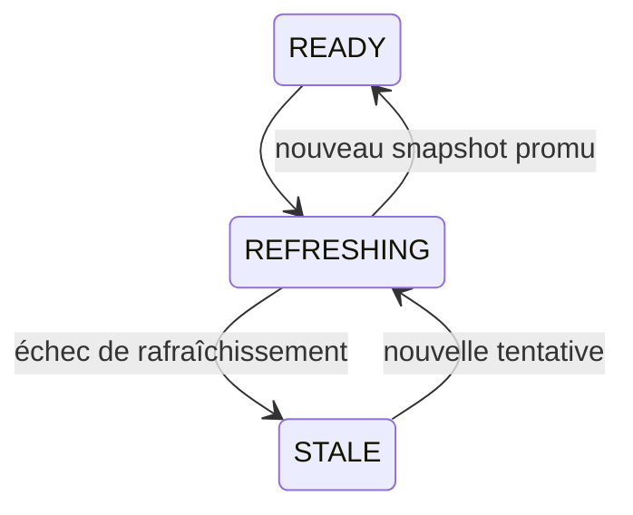

# Dépannage

Ce guide part des surfaces stables de MINOS : CLI, registre projet, import SCIP, snapshots, MCP et export NEXUS.

## `BUILD FAILURE` avant compilation

Vérifier d’abord :

```powershell
java -version
.\mvnw.cmd -version
```

MINOS exige Java 24 et Maven 3.9.x. Le Maven Wrapper doit lui aussi s’exécuter avec un JDK 24.

## `project root is not registered`

Cause : une commande cible une racine qui n’existe pas dans le registre MINOS.

Diagnostic :

```powershell
java -jar $minos project list
java -jar $minos inspect <project>
```

Correction :

```powershell
java -jar $minos project add <root> --name <name>
```

## Projet enregistré mais racine indisponible

`inspect` expose `rootAvailable`. Si la racine a été déplacée, montée sous une autre lettre de lecteur ou supprimée, MINOS conserve le registre mais ne peut pas lire le workspace local.

Réutiliser la racine enregistrée ou réenregistrer le projet approprié.

## `index` échoue

Vérifier :

- l’existence de `index.scip` ;
- le `--provider` ;
- les permissions de lecture ;
- la cohérence entre l’artefact et le projet ciblé.

Commande de référence :

```powershell
java -jar $minos index <project> `
  --scip <index.scip> `
  --provider <provider-id> `
  --format json
```

MINOS ne génère pas automatiquement l’artefact SCIP.

## Pas de résultat dans `find-callers` ou `find-callees`

Une liste vide ne signifie pas forcément qu’aucun appel n’existe au runtime. Elle signifie qu’aucune relation `CALLS` correspondante n’est présente dans le snapshot observé.

Les limites possibles incluent notamment : dispatch dynamique, réflexion, configuration runtime et capacités incomplètes du fournisseur.

## `impact` retourne des limitations

C’est normal : l’analyse d’impact est volontairement conservatrice. Les limitations décrivent les dimensions que le graphe statique ne prouve pas.

Ne pas interpréter un rapport d’impact comme une preuve d’exhaustivité runtime.

## `STALE`

`STALE` signifie qu’un rafraîchissement a échoué mais qu’un snapshot actif précédent reste disponible.



Les requêtes peuvent continuer à utiliser le snapshot actif précédent ; vérifier cependant sa date et son contexte.

## `FAILED`

`FAILED` indique un échec sans snapshot actif utilisable. Corriger la cause d’indexation puis relancer un import/run.

## MCP : le client ne démarre pas MINOS

Vérifier :

1. le chemin vers `java.exe` Java 24 ;
2. le chemin du shaded JAR ;
3. la classe `com.minos.mcp.MinosMcpServer` ;
4. `MINOS_HOME` ;
5. que le wrapper/script de lancement n’écrit rien sur stdout.

Commande minimale :

```powershell
java -cp <minos-all.jar> com.minos.mcp.MinosMcpServer
```

## MCP : erreur de schema

Les schemas MCP rejettent les clés inconnues et les valeurs hors bornes. Vérifier les limites documentées dans [mcp.md](mcp.md).

## `nexus-export` échoue

Préconditions : projet enregistré + snapshot actif + racine réelle accessible.

```powershell
java -jar $minos inspect <project>
java -jar $minos index-status <project>
```

Pour inspecter le JSON :

```powershell
java -jar $minos nexus-export --root <root> > export.json
Get-Content export.json
```

## JSON difficile à exploiter

Préférer `--format json` sur les commandes CLI prévues pour l’automatisation. `nexus-export` produit directement le contrat JSON sur stdout.

## Changer temporairement de home MINOS

```powershell
$env:MINOS_HOME = 'N:\temp\minos-home'
java -jar $minos project list
```

Ou :

```powershell
java -Dminos.home=N:\temp\minos-home -jar $minos project list
```

La propriété JVM est prioritaire.

## Réinitialiser un environnement de test

Pour un environnement de test dédié uniquement, utiliser un nouveau `MINOS_HOME` vide plutôt que supprimer arbitrairement des fichiers d’un home partagé.

## Collecter un diagnostic reproductible

Fournir au minimum :

```text
git rev-parse HEAD
java -version
mvnw -version
commande exécutée
code de sortie
stdout
stderr
MINOS_HOME utilisé
```

Pour un problème d’index, ajouter le fournisseur SCIP, sa version et le résultat de `index-status`.
