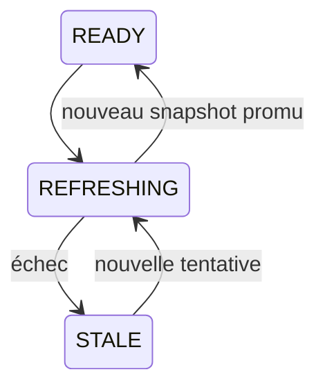

# Dépannage

Ce guide couvre l’installation native M14, les providers, l’indexation autonome, les snapshots, MCP et NEXUS.

## Commencer par `doctor`

Pour une installation utilisateur :

```powershell
minos.cmd doctor
```

Pour un checkout source :

```powershell
.\minos.cmd doctor
```

Le diagnostic indique le runtime MINOS, les commandes projet disponibles et l’état de chaque provider géré.

## `BUILD FAILURE` lors du développement de MINOS

Ce cas concerne le checkout source :

```powershell
java -version
.\mvnw.cmd -version
```

Le développement de MINOS exige Java 24 et Maven 3.9.x via le wrapper.

Une distribution installée embarque son propre runtime et n’exige pas un JDK système pour exécuter la CLI/MCP.

## `project root is not registered`

Diagnostic :

```powershell
minos.cmd project list
minos.cmd inspect <project>
```

Correction :

```powershell
minos.cmd project add <root> --name <name>
```

## Projet enregistré mais racine indisponible

`inspect` expose `rootAvailable`.

Si la racine a été déplacée, si une lettre de lecteur a changé ou si un volume n’est plus monté, MINOS conserve l’identité enregistrée mais ne peut plus découvrir/lire le projet.

Réenregistrer le bon projet ou rétablir exactement la racine attendue.

## `index` échoue avant de lancer le provider

Exécuter :

```powershell
minos.cmd index <project> --dry-run --format json
minos.cmd doctor --format json
minos.cmd tools list --format json
```

Causes typiques :

- aucun provider qualifié pour le langage/build détecté ;
- runtime provider non installé ;
- `JAVA_HOME` absent ou ne contenant pas `javac` pour `scip-java` ;
- `node`/`npm` absents pour `scip-typescript` hors Windows (sous Windows, Node.js est livré dans la distribution complète) ;
- configuration projet non supportée par la qualification courante.

Installer un provider :

```powershell
minos.cmd tools install scip-java
# ou
minos.cmd tools install scip-typescript
```

## `scip-java` est `BLOCKED`

`scip-java` utilise le JDK du projet, pas le runtime Java embarqué de MINOS. Sur Windows, le poste doit fournir, en plus des outils livrés par MINOS (Coursier, Maven, classpath de scip-java) : un **JDK complet** (`JAVA_HOME` avec `javac.exe` et `jar.exe`), **Git for Windows** (`Git\bin\bash.exe`), **Windows PowerShell 5.1** et `csc.exe` (livrés par Windows). Chaque manque est nommé par `minos.cmd doctor` avec le préfixe `machine prerequisite (not shipped by MINOS)`.

Vérifier :

```powershell
$env:JAVA_HOME
& "$env:JAVA_HOME\bin\javac.exe" -version
```

Puis relancer :

```powershell
minos.cmd doctor
minos.cmd index <project> --dry-run
```

## Windows : « cannot grant AppContainer read access … without administrator privileges »

**MINOS n'exige jamais de droits administrateur pour indexer** : ni pour installer, ni pour lancer, ni pour utiliser le MCP natif, ni pour indexer avec `scip-java` ou un autre provider — y compris en développement, lancé depuis IntelliJ avec un JDK installé sous `Program Files`.

La sandbox Windows (AppContainer + Job Object) accorde un accès lecture temporaire à chaque racine dont un provider a réellement besoin (runtime managé MINOS, `JAVA_HOME` du projet, etc.), puis le révoque à la fin de l'exécution. Cet octroi mute la DACL de la ressource ; un utilisateur standard ne peut le faire que sur une ressource qu'il possède (son propre profil, `%LOCALAPPDATA%`, un répertoire MINOS géré). Il ne peut jamais muter la DACL d'un objet appartenant à `TrustedInstaller`/`Administrators`, ce qui inclut la plupart des sous-répertoires de `Program Files` et de `%SystemRoot%`, avec ou sans élévation.

Si `JAVA_HOME` (ou un autre répertoire d'outillage : `DOTNET_ROOT`, `CARGO_HOME`, `RUSTUP_HOME`, `COURSIER_CACHE`) pointe vers un JDK/toolchain installé sous `Program Files`, l'indexation échoue proprement avec ce message plutôt que de demander une élévation ou de contourner la sandbox. C'est un refus volontaire (« fail-closed ») : MINOS ne modifiera jamais un répertoire système ou appartenant à un autre compte pour continuer.

Correction : installer/pointer `JAVA_HOME` (ou la variable concernée) vers une toolchain possédée par l'utilisateur courant, par exemple une JDK installée sous `%LOCALAPPDATA%` (beaucoup de gestionnaires de JDK — SDKMAN pour Windows, Coursier `cs java`, une extraction manuelle d'archive — installent déjà à cet emplacement) plutôt que sous `Program Files`.

Le périmètre M14 initial qualifie le provider Java sur Maven. Un projet hors de ce périmètre doit rester explicitement non couvert plutôt que recevoir une fausse garantie.

## Windows : « private storage is write-protected by an explicit deny entry »

MINOS ne retire jamais un refus (ACE `DENY`) posé par un administrateur sur `MINOS_HOME` ou sur un de ses sous-répertoires : si ce
refus l'empêche d'écrire, la commande échoue en le disant, sans chemin dans le message. Un `MINOS_HOME` protégé en écriture fait
aujourd'hui échouer **même les commandes de lecture** (`project list`, `doctor`…) : une commande de lecture ouvre encore le stockage en
écriture (suivi sous la référence R12, non fermée). Pour lever la protection, retirez le refus vous-même :
`icacls "<MINOS_HOME>" /remove:d <compte> /T` (un refus hérité d'un parent est devenu explicite sur les objets que MINOS a durcis,
d'où `/T`).

## Windows : le bac à sable est indisponible, `minos-launchers` refusé

Les scripts des lanceurs du bac à sable vivent sous `%LOCALAPPDATA%\minos-launchers\<sha256>\` et sont contrôlés avant chaque
lancement. Quand un contrôle échoue, MINOS **refuse** : le backend est déclaré indisponible (avertissement dans le journal, aucun repli
vers un bac à sable moins isolant) et `doctor` le montre. Les causes, par message :

- `another principal can replace what is under its directory` : un autre compte que vous, SYSTEM ou Administrateurs peut supprimer
  un enfant de `%LOCALAPPDATA%`, réécrire sa DACL ou en prendre possession (une ACE accordée à « Tout le monde », à « Utilisateurs »
  ou à un groupe tiers). Vérifiez `icacls "%LOCALAPPDATA%"` et retirez la ACE.
- `its directory is owned by another principal` : le propriétaire de `%LOCALAPPDATA%` n'est ni vous, ni SYSTEM, ni Administrateurs.
- `reached through a link or a reparse point` : un ancêtre du répertoire est une jonction ou un lien (profil redirigé derrière une
  jonction). MINOS ne suit pas ce chemin ; placez `%LOCALAPPDATA%` sur un vrai répertoire.
- `owned by another principal` (racine, répertoire ou fichier) ou `integrity check failed` : le contenu ou le propriétaire de
  `minos-launchers` n'est pas celui que MINOS a créé. Cas fréquent : une session **élevée** après une racine créée non élevée (ou
  l'inverse) : le propriétaire diffère. Supprimez `%LOCALAPPDATA%\minos-launchers` depuis la session qui ne la reconnaît pas ; MINOS la
  recrée.

Le désinstalleur ne supprime pas `%LOCALAPPDATA%\minos-launchers` (quelques dizaines de Ko par version du script) : supprimez-le à la
main si vous désinstallez MINOS.

## `scip-typescript` est `BLOCKED`

Vérifier :

```powershell
node --version
npm --version
```

MINOS installe le provider, **pas les dépendances métier du projet**.

Si `node_modules` ou les dépendances nécessaires au projet sont absentes, les préparer selon le workflow normal du projet avant `minos index`.

## Provider installé mais indexation échoue

Chaque run conserve ses diagnostics sous :

```text
<MINOS_HOME>/runs/<runId>/<provider>/
```

Consulter :

```text
provider.stdout.log
provider.stderr.log
process.txt
failed-index.scip   # uniquement s’il existe
```

Le message CLI indique le `runId` ou le fichier de log lorsque cela est disponible.

## Un `index.scip` existant dans le projet a disparu

Le runtime M14 est conçu pour préserver/restaurer un `index.scip` préexistant autour de l’exécution provider.

Si ce contrat semble violé, ne relancer pas plusieurs indexations en parallèle. Conserver le répertoire `<MINOS_HOME>/runs/<runId>` et signaler le SHA exact de MINOS.

## Import manuel d’un artefact SCIP

Pour diagnostiquer un artefact externe sans lancer le provider :

```powershell
minos.cmd import-scip <project> `
  --file <index.scip> `
  --provider <provider-id> `
  --format json
```

La forme historique `index --scip` reste temporairement acceptée mais est dépréciée.

## `NO_CHANGES`

Ce résultat signifie que le fingerprint courant correspond à la baseline active et que le planner M7 a choisi `NONE`.

Pour forcer une requalification :

```powershell
minos.cmd index <project> --force-full
```

## Pourquoi MINOS fait `FULL` pour une petite modification ?

C’est volontaire lorsque le provider sélectionné ne possède pas une capacité `INCREMENTAL_INDEXING` explicitement qualifiée.

M14 n’invente pas un incrémental que le fournisseur ne prouve pas.

## `STALE`

`STALE` signifie qu’un refresh a échoué mais qu’un ancien snapshot actif reste disponible :


```mermaid
stateDiagram-v2
    READY --> REFRESHING
    REFRESHING --> READY: nouveau snapshot promu
    REFRESHING --> STALE: échec
    STALE --> REFRESHING: nouvelle tentative
```

Les requêtes peuvent continuer à lire l’ancien snapshot. Corriger la cause provider/build puis relancer `index`.

## `FAILED`

`FAILED` signifie qu’aucun snapshot actif utilisable n’existe après un échec initial.

Corriger `doctor`/provider/build puis relancer l’indexation.

## Le workspace a changé pendant l’indexation

MINOS compare un fingerprint avant/après le run.

Si le workspace change pendant l’exécution, le fingerprint baseline n’est pas promu. Le prochain `index` replanifiera conservativement le projet.

## Pas de résultat dans `find-callers` / `find-callees`

Une liste vide signifie qu’aucune relation `CALLS` correspondante n’est présente dans le snapshot observé. Cela ne prouve pas une absence runtime.

Limites possibles : dispatch dynamique, réflexion, configuration runtime ou capacités incomplètes du provider.

## `impact` retourne des limitations

Normal : l’impact est volontairement conservateur et décrit une estimation du graphe observé, pas une preuve d’exhaustivité runtime.

## MCP natif ne démarre pas

Installation :

```powershell
minos.cmd --version
minos.cmd doctor
minos.cmd mcp
```

Dans une configuration MCP, utiliser le launcher directement :

```text
command = <installation>\minos.cmd
args    = mcp
```

Le processus MCP utilise stdout pour le protocole ; ne pas insérer de wrapper qui écrit du texte arbitraire sur stdout.

## Docker MCP ne démarre pas

Le mode Docker est optionnel et séparé du runtime natif.

Vérifier :

```powershell
docker version
.\docker\scripts\prod-mcp-release.ps1 -Action Status
.\docker\scripts\prod-mcp-release.ps1 -Action Validate
```

Le home Docker est distinct du home natif afin de ne pas mélanger des chemins `N:\...` avec `/workspace/projects/...`.

## MCP : erreur de schéma

Les schemas rejettent les clés inconnues et valeurs hors bornes. Voir [mcp.md](mcp.md).

## `nexus-export` échoue

Préconditions : projet enregistré, snapshot actif et racine réelle accessible.

```powershell
minos.cmd inspect <project>
minos.cmd index-status <project>
minos.cmd nexus-export --root <root> > export.json
```

Si aucun snapshot n’existe encore :

```powershell
minos.cmd index <project>
```

## `project list` sort avec le code 3

Diagnostic :

```powershell
minos.cmd project list --format json
```

Le code 3 veut dire « inventaire partiel » : les projets lisibles sont listés, et une ou plusieurs entrées sont abîmées. Elles figurent dans la liste à l'état `UNREADABLE` et dans `degraded` (identifiant d'entrée et raison, sans chemin). Le fichier concerné est `registry/projects/<identifiant>.properties` du `MINOS_HOME`, ou `cli-index-history/<identifiant>.properties` pour un historique.

Correction : réparer ou supprimer l'entrée nommée (un projet supprimé du registre se réenregistre avec `project add`), puis relancer `project list` : le code 0 confirme que l'inventaire est complet.

## `inspect <nom>` ou `index-status <nom>` sort avec le code 3

Le registre contient une entrée illisible et le projet est désigné **par son nom** : MINOS ne peut pas prouver que ce nom est unique, ni qu'il n'existe pas.

- Si le projet est affiché, `warning: N registry entries are unreadable, so this name cannot be proven unique` : la réponse est valide, le code dit qu'elle est incomplète.
- Si rien n'est affiché, `N registry entries are unreadable, so it cannot be told whether this project exists` : ce n'est pas « projet inexistant » (`unknown project`, code 1).

Diagnostic : `minos.cmd project list --format json` nomme les entrées illisibles (`degraded`). Contournement immédiat : désigner le projet par son identifiant (UUID), qui ne lit que son entrée. Correction : réparer ou supprimer l'entrée nommée.

## Changer temporairement de home

```powershell
$env:MINOS_HOME = 'N:\temp\minos-home'
minos.cmd project list
```

Depuis un checkout source, la propriété JVM reste prioritaire :

```powershell
java -Dminos.home=N:\temp\minos-home -jar <minos-all.jar> project list
```

## Réinitialiser un environnement de test

Utiliser de préférence un nouveau `MINOS_HOME` vide. Ne supprimer pas arbitrairement des fichiers dans un home partagé contenant des snapshots utiles.

## Collecter un diagnostic reproductible

Pour un checkout source :

```text
git rev-parse HEAD
java -version
.\mvnw.cmd -version
```

Toujours fournir :

```text
MINOS --version
commande exacte
code de sortie
stdout
stderr
MINOS_HOME
minos doctor --format json
minos index <project> --dry-run --format json
runId
logs du run provider
```

Pour un problème de release, ajouter le nom du ZIP et son SHA-256.
